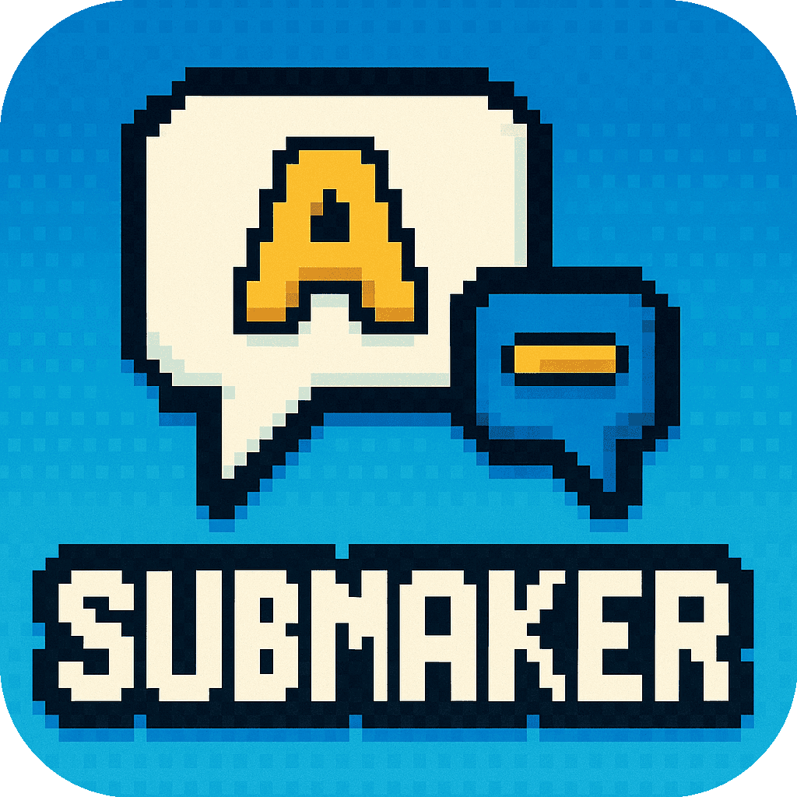

<p align="center">
  
</p>

<h1 align="center">SubMaker</h1>

<p align="center">
  <b>AI-Powered Subtitle Translation for Stremio</b><br/>
  Watch any content in your language. Fetch subtitles from multiple sources, translate instantly with AI — without ever leaving your player.
</p>

<p align="center">
  <a href="https://www.gnu.org/licenses/agpl-3.0"></a>
  
  
  
  
</p>

<p align="center">
  <a href="#-try-it-now">Try It Now</a> •
  <a href="#-features">Features</a> •
  <a href="#-quick-start">Quick Start</a> •
  <a href="#-how-it-works">How It Works</a> •
  <a href="#-troubleshooting">Troubleshooting</a>
</p>

---

## 🎉 Try It Now

**No setup required!**

### **[https://submaker.elfhosted.com](https://submaker.elfhosted.com)**

Configure, install, done. A huge thanks to [ElfHosted](https://elfhosted.com) for the free community hosting!

Check their [FREE Stremio Addons Guide](https://stremio-addons-guide.elfhosted.com/) for more great addons and features!

> For self-hosting, see [Quick Start](#-quick-start) below.

---

## ✨ Features

| Category | Highlights |
|----------|------------|
| **Languages** | 197 supported languages (433 for translation) |
| **Subtitle Sources** | OpenSubtitles, SubDL, SubSource, Wyzie, Stremio Community, Subs.ro |
| **AI Translation** | 10+ providers: Gemini, OpenAI, Claude, DeepL, DeepSeek, Grok, Mistral, OpenRouter, Cloudflare, Custom/Local |
| **Smart Caching** | Shared translation database — translate once, benefit everyone |
| **Workflows** | XML Tags, Original Timestamps, Send Timestamps to AI |
| **JSON Structured Output** | API-level JSON enforcement for reliable parsing (Gemini, OpenAI, etc.) |
| **Mobile Ready** | Android/iOS optimized with dedicated Mobile Mode |
| **No-Translation Mode** | Just fetch subtitles without translation |

---

### 🌍 Subtitle Sources

| Provider | Auth Required | Notes |
|----------|---------------|-------|
| OpenSubtitles | Optional (recommended) | V3 or authenticated mode |
| SubDL | API key | [subdl.com/panel/api](https://subdl.com/panel/api) |
| SubSource | API key | [subsource.net](https://subsource.net/) |
| Wyzie Subs | None | Aggregator (beta) |
| Stremio Community Subtitles | None | Curated subtitles (beta) |
| Subs.ro | API key | Romanian subtitles (beta) |

### 🤖 AI Translation Providers

| Provider | Notes |
|----------|-------|
| **Google Gemini** | Default, free tier available, key rotation supported |
| OpenAI | GPT models |
| Anthropic | Claude models |
| DeepL | Traditional translation API |
| DeepSeek | |
| XAI (Grok) | |
| Mistral | |
| OpenRouter | Access multiple models |
| Cloudflare Workers AI | |
| Google Translate | Unofficial, no key needed |
| Custom | Ollama, LM Studio, LocalAI, any OpenAI-compatible API |

---

## 🚀 Quick Start

### Prerequisites

- **Node.js** 18+ — [nodejs.org](https://nodejs.org)
- **Gemini API Key** — [Get free](https://aistudio.google.com/app/api-keys)
- At least one subtitle provider key (optional but recommended)

### Installation

```bash
# Clone and install
git clone https://github.com/xtremexq/StremioSubMaker.git
cd StremioSubMaker
npm install

# Create and configure .env
cp .env.example .env
nano .env

# Start the server
npm start
```

### 🐳 Docker

📦 **[See complete Docker deployment guide →](docs/DOCKER.md)**

### Open Configuration

Visit: **http://localhost:7001**

---

## 🎯 How It Works

```
1. Install SubMaker in Stremio
2. Play content → Subtitles list shows "Make [Language]" buttons
3. Click → Select source subtitle to translate
4. Wait ~1-3 minutes → AI translates in batches
5. Reselect the subtitle → Now translated!
6. Next time? Instant — cached in database
```

### Configuration Steps

1. **Add Subtitle Sources API keys**
2. **Add Gemini API Key** (required for translation)
3. **Select source languages** (translate from)
4. **Select target languages** (translate to)
5. **Click "Install in Stremio"** or copy the URL

### Pro Tips

| Tip | Description |
|-----|-------------|
| **Single source language** | Keeps subtitle order consistent |
| **Test sync first** | Try original subtitle before translating |
| **Triple-click** | Forces re-translation if result looks wrong |
| **Use Flash-Lite** | Fastest model, check rate limits |

---

## ⚙️ Configuration Guide

### Sections Overview

| Section | Purpose |
|---------|---------|
| **API Keys** | Subtitle providers and AI translation keys |
| **Languages** | Source (translate from) and target (translate to) |
| **Settings** | Translation behavior, workflows, and caching |

### Key Settings

| Setting | Recommendation |
|---------|----------------|
| Translation Workflow | "XML Tags" for best sync |
| Database Mode | "Use SubMaker Database" for shared caching |
| Provider Timeout | 12s default, increase to 30s for SCS/Wyzie |
| Mobile Mode | Enable for Android/iOS |

### Advanced Mode

Enable "Advanced Mode" in Other Settings to unlock:
- Batch Context (surrounding context for coherence)
- Mismatch Retries (retry on wrong entry count)
- Gemini Parameters (temperature, top-p, thinking budget)

---

## 🐛 Troubleshooting

> **📖 Full Guide:** [TROUBLESHOOTING.md](docs/TROUBLESHOOTING.md)

### ⏱️ Subtitles Out of Sync?

Test other **Translation Workflow** in Settings:
| Workflow | Description |
|----------|-------------|
| **XML Tags** (default) | Uses XML id tags for reconstruction |
| **Original Timestamps** | Reattaches original timecodes using numbered entries |
| **Send Timestamps to AI** | Trusts AI to preserve timecodes |

### 🔄 Bad / Broken Translation?

1. **Force re-translation** — Triple-click the subtitle (within 6 seconds)
2. **Try a different model** — Switch between Flash-Lite, Flash, or others
3. **Bypass cache** — Enable "Bypass Cache" in Translation Settings

### ❌ Translation Fails / Rate Limits?

1. **Validate API key** — Test at [Google AI Studio](https://aistudio.google.com)
2. **Switch model** — Gemma 27b has higher rate limits than Flash
3. **Enable key rotation** — Add multiple Gemini keys
4. **Use secondary provider** — Enable fallback provider

### 📱 Android / Mobile Issues?

1. **Enable Mobile Mode** — Check "Mobile Mode" in Other Settings
2. **Wait 1-3 minutes** — Mobile delivers complete subtitle when ready
3. **Use Flash-Lite** — Fastest model for mobile

### 💾 Configuration Not Saving?

1. **Verify Token** — Ensure installed token matches config page
2. **Hard refresh** — `Ctrl+F5` (Windows/Linux) or `Cmd+Shift+R` (Mac)
3. **Check console** — `F12` → Console for errors
4. **Try incognito** — Rules out extension conflicts

### ⚡ Reset Everything

Click the **Reset** button at the bottom of the config page.

---

## 🙏 Acknowledgments

**Built With**
- [Stremio Addon SDK](https://github.com/Stremio/stremio-addon-sdk) — Addon framework
- [OpenSubtitles](https://www.opensubtitles.com/) — Primary subtitle database
- [SubDL](https://subdl.com/) — Alternative subtitle source
- [SubSource](https://subsource.net/) — Alternative subtitle source
- [Google Gemini](https://ai.google.dev/) — AI translation

**Special Thanks**
- Stremio team for excellent addon SDK
- Google for free Gemini API access
- All subtitle communities
- [ElfHosted](https://elfhosted.com/) — Free community hosting

---

## 📧 Support

| Channel | Link |
|---------|------|
| **Issues & Bugs** | [Open an issue](https://github.com/xtremexq/StremioSubMaker/issues) |
| **Documentation** | Check `/public/configure.html` for interactive help |
| **Community** | [Stremio Discord](https://discord.gg/stremio) • [r/StremioAddons](https://reddit.com/r/StremioAddons) |

---

<p align="center">
  <b>SubMaker</b> — Watch anything. Understand everything. Any language.<br/>
  <sub>Made with ❤️ for the Stremio community</sub>
</p>

<p align="center">
  <a href="https://github.com/xtremexq/StremioSubMaker">⭐ Star this repo</a> •
  <a href="https://github.com/xtremexq/StremioSubMaker/issues">🐛 Report Bug</a> •
  <a href="https://github.com/xtremexq/StremioSubMaker/issues">✨ Request Feature</a>
</p>
